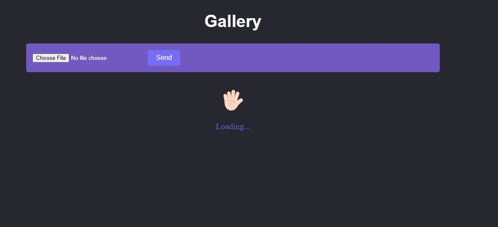
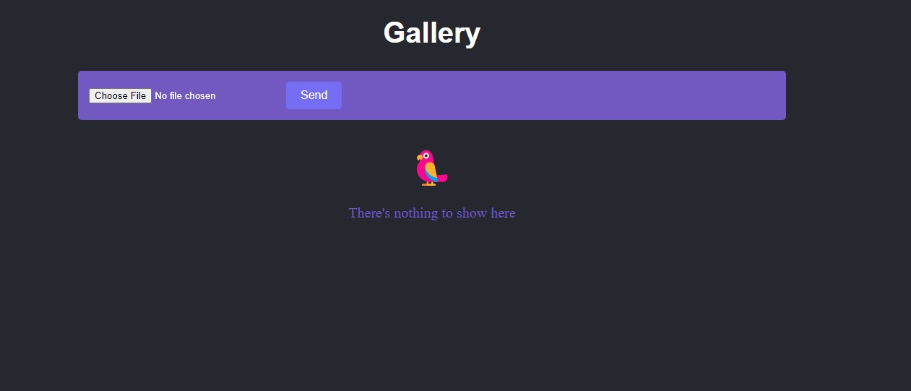
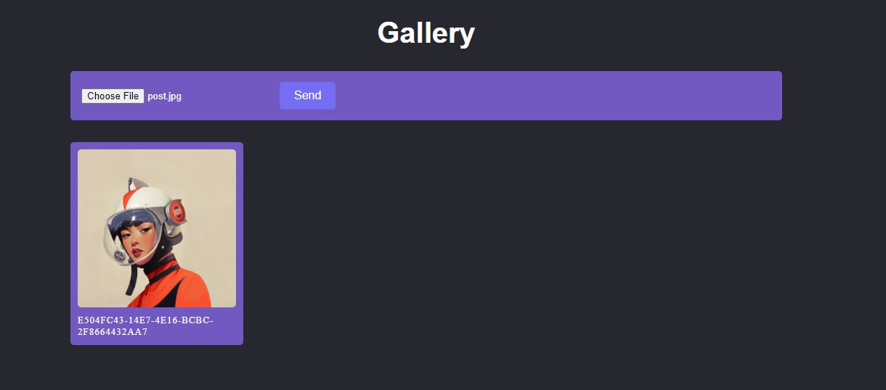

## Gallery Project

## Technologies

<ul>
<li>
    React [CRA] + TypeScript
</li>
<li>
    Styled-Components
</li>
<li>
    UUID(v4)
</li>
<li>
    FIREBASE🔥
</li>
</ul>

## Screenshots

## Loading

## Without an image to be shown

## Image add

## Disclaimer

To use this project you need to have an account on firebase or use Gmail's yours

## ``NPM INSTALL``
- To add the packages used

## ``NPM RUN``
- To run this project